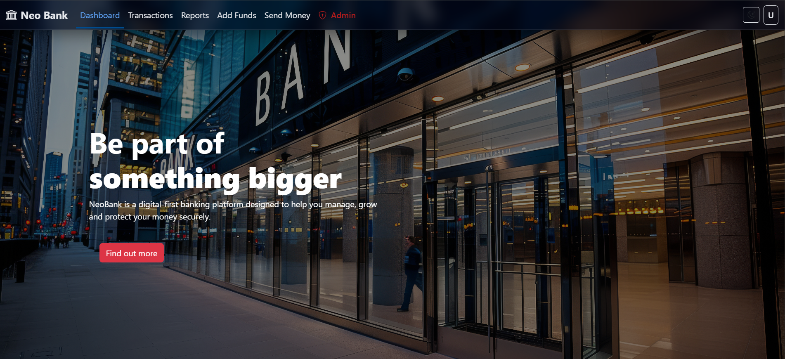
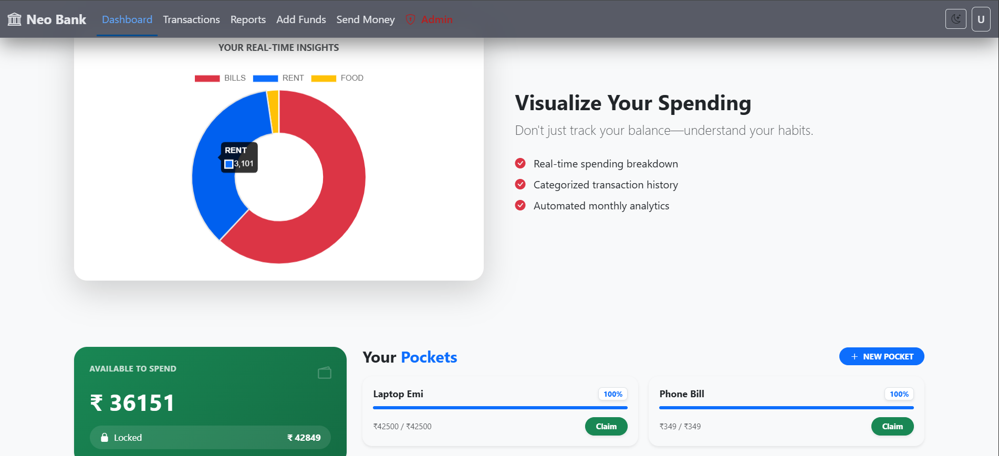
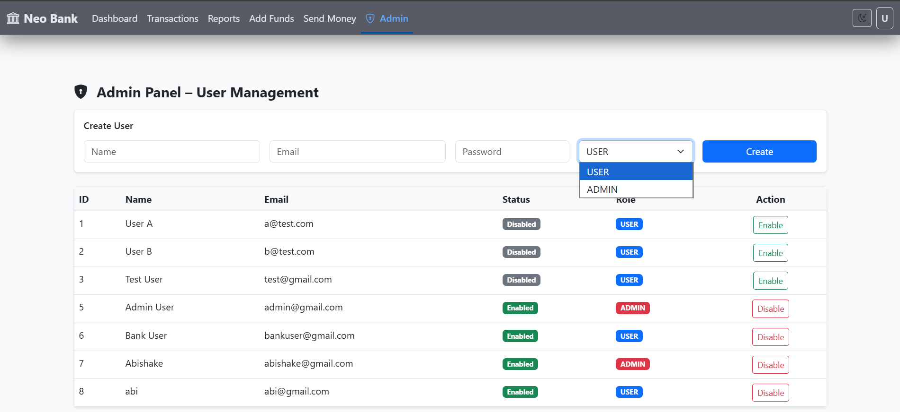
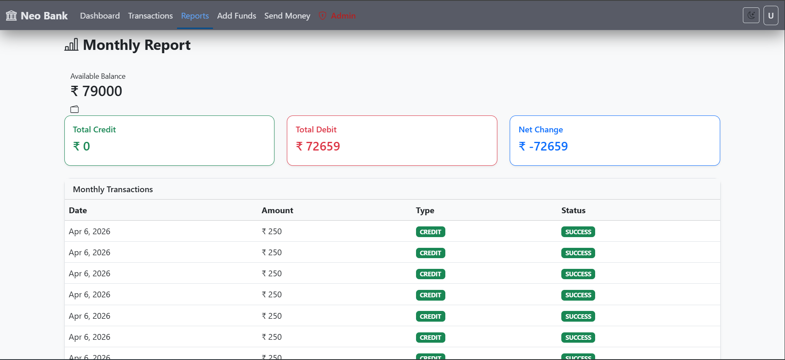
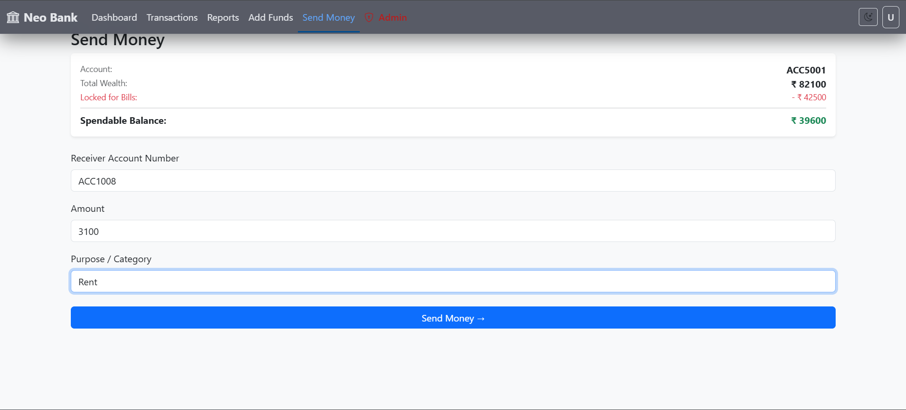
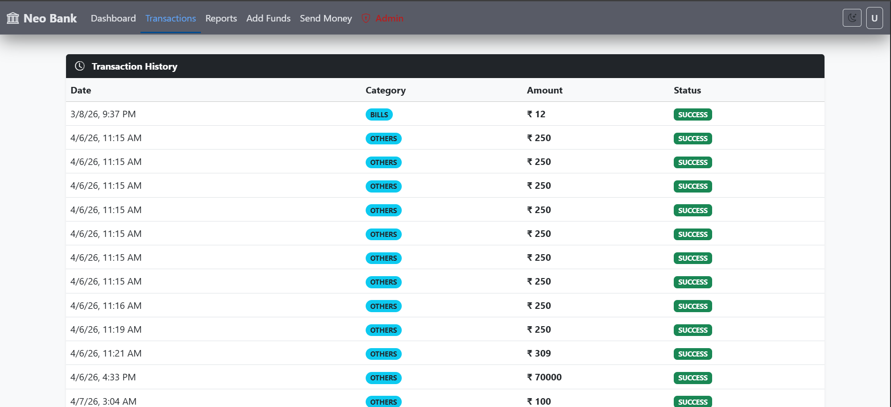
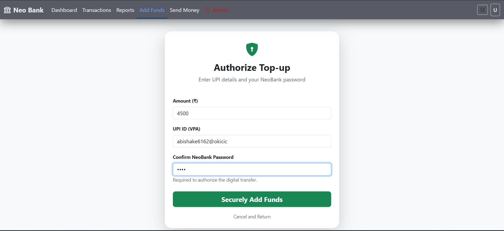
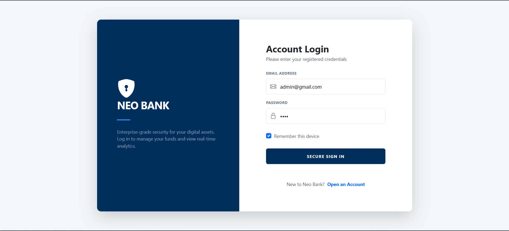

# NeoBank – Digital Banking Portal

NeoBank is a simple and secure full-stack website that acts like a real-world digital bank. It allows users to manage their money, track their spending, and save for future goals through a clean, modern interface.

## Overview

**Smart Tools:**
- **Virtual Pockets**: Create separate "pockets" to stash money away for specific goals (like a new laptop or travel). This keeps your savings safe from your everyday spending.
- **Detailed Reports**: View your monthly activity in a clean format to see where your money is going.
- **Smart Analytics**: Visual charts that show your spending patterns and account growth over time.

---

## Live Demo

<p align="center">
  <a href="https://neobank-digital-banking-portal.vercel.app/">
    
  </a>
  <br>
  <em><strong>Click the image above to view the live portal</strong></em>
</p>

---

## Key Features

### Security and Access Control
- **JWT Authentication**: Robust stateless security using JSON Web Tokens with access & refresh tokens
- **Role-Based Access Control (RBAC)**: Distinct workflows and permissions for User and Admin roles
- **Spring Security Integration**: Secured API endpoints with user authentication
- **Protected Routes**: Angular route guards prevent unauthorized access to sensitive pages

### Banking Operations
- **Real-Time Dashboard**: Instant access to available and locked balances with automated UI synchronization
- **Virtual Pockets**: Create and manage targeted savings goals with automated fund stashing and claim functionality
  - Users can create multiple savings goals
  - Lock money away for specific purposes (EMI, travel, laptop, etc.)
  - Claim funds back to available balance when needed
- **Fund Transfers**: Secure peer-to-peer transfers between accounts with category-based tracking
- **Transaction Categorization**: Organize transactions by category for better financial insights
- **Data Analytics**: Interactive spending breakdowns and financial summaries powered by Chart.js

### Reporting & Analytics
- **Monthly Financial Reports**: Detailed breakdown of spending by category and time period
- **Account Summary Reports**: Overview of account activity and balance trends
- **Visual Charts**: Interactive charts displaying spending patterns and savings progress
- **Transaction History**: Complete transaction log with filters and search

### User Interface
- **Angular 19 (Latest)**: Built using the latest framework standards with Standalone Components and Signals
- **Adaptive Theming**: Full support for professional Dark Mode and Light Mode with persistent state management
- **Responsive Design**: Optimized for mobile, tablet, and desktop environments using Bootstrap 5
- **Bootstrap Icons**: Icon library for consistent and modern UI elements
- **Real-Time Loading States**: Visual feedback during API calls

###  Admin Features
- **User Management Dashboard**: View and manage all users in the system
- **User Status Control**: Activate/deactivate user accounts
- **System Monitoring**: Admin panel for system oversight


---

## Tech Stack

| Layer | Technologies |
|-------|--------------|
| **Frontend** | Angular 19.2.0, TypeScript 5.7.2, Bootstrap 5.3.8, Chart.js 4.5.1, ng2-charts 10.0.0 |
| **Backend** | Java 21, Spring Boot 4.0.0, Spring Security, JWT (jjwt 0.11.5), Lombok, Spring Data JPA |
| **Database** | TiDB Cloud (MySQL-compatible Distributed SQL) |
| **DevOps** | Docker, Vercel (Frontend), Render (Backend API) |
| **Testing** | Jasmine, Karma (Frontend); JUnit 5 (Backend) |


---

**Key Features:**
- Standalone Angular Components
- Responsive Bootstrap 5 UI
- Real-time transaction analytics with Chart.js
- Role-based routing with auth guards

---

## Setup and Installation

### Prerequisites
- JDK 21 or higher
- Node.js 18 or higher (with Angular CLI)
- Maven 3.8+

### Backend Setup

1. Navigate to the backend directory:
   ```bash
   cd backend-banking-portal
   ```

2. Configure your database connection in `src/main/resources/application.properties`

3. Build and run the application:
   ```bash
   mvn spring-boot:run
   ```

### Frontend Setup

1. Navigate to the frontend directory:
   ```bash
   cd frontend-banking-portal-ui
   ```

2. Install the required dependencies:
   ```bash
   npm install
   ```

3. Launch the development server:
   ```bash
   ng serve
   ```

---
## Screenshots

### Dashboard with Transaction Analytics and Virtual Pockets


### Admin Portal


### Monthly Report


### Send Money


### Transaction History


### Deposit Money


### Login Page



## API Documentation

### Authentication Endpoints
| Method | Endpoint | Description |
|--------|----------|-------------|
| POST | `/api/auth/login` | Authenticates user and returns JWT access token & refresh token |

### Account Endpoints
| Method | Endpoint | Description |
|--------|----------|-------------|
| GET | `/api/accounts/my` | Retrieves current user account details and balance |
| GET | `/api/accounts/balance` | Gets available and locked balance information |

### Transaction Endpoints
| Method | Endpoint | Description |
|--------|----------|-------------|
| POST | `/api/transactions/transfer` | Executes a fund transfer between accounts |

### Savings Goals Endpoints (Virtual Pockets)
| Method | Endpoint | Description |
|--------|----------|-------------|
| GET | `/api/savings/my-pockets` | Fetches all savings goals associated with the user |
| POST | `/api/savings/create` | Creates a new savings goal/pocket |
| POST | `/api/savings/stash` | Moves funds from available balance to a specific pocket |
| DELETE | `/api/savings/claim/{id}` | Closes a savings goal and returns funds to available balance |

### Report Endpoints
| Method | Endpoint | Description |
|--------|----------|-------------|
| GET | `/api/reports/summary/{accountId}` | Retrieves account summary report |
| GET | `/api/reports/monthly/{accountId}` | Fetches monthly financial report with categorized transactions |

### Admin Endpoints
| Method | Endpoint | Description |
|--------|----------|-------------|
| GET | `/api/admin/users` | Retrieves all users (admin only) |
| POST | `/api/admin/users` | Creates a new user (admin only) |
| PUT | `/api/admin/users/{id}/status` | Updates user status (admin only) |


---

## Future Enhancements

- PDF/CSV statement download
- Two-factor authentication (2FA)
- Email notifications
- Admin analytics dashboard

---

## Quick Start

### Running the Complete Application

#### Backend (Terminal 1)
```bash
cd backend-banking-portal
mvn spring-boot:run
# Backend will run on: http://localhost:8080
```

#### Frontend (Terminal 2)
```bash
cd frontend-banking-portal-ui
npm install
ng serve
# Frontend will run on: http://localhost:4200
```

Then open your browser and navigate to **http://localhost:4200**

---

## Database Configuration

The application uses **TiDB Cloud** as the database. Configuration is located in:
- **File**: `backend-banking-portal/src/main/resources/application.properties`

**Key Settings:**
```properties
spring.datasource.url=jdbc:mysql://gateway01.ap-southeast-1.prod.aws.tidbcloud.com:4000/fintech_db?sslMode=VERIFY_IDENTITY
spring.jpa.hibernate.ddl-auto=update  # Auto-create/update tables
spring.jpa.database-platform=org.hibernate.dialect.MySQL8Dialect
```

---

## Testing

### Frontend Tests
```bash
cd frontend-banking-portal-ui
ng test  # Run Jasmine tests with Karma
```

### Backend Tests
```bash
cd backend-banking-portal
mvn test  # Run JUnit tests
```

---

## Deployment

- **Frontend**: Deployed on [Vercel](https://vercel.com/) - automatic deployments from Git
- **Backend**: Deployed on [Render](https://render.com/) - REST API service
- **Database**: TiDB Cloud (managed database service)

---

## Project Status

The NeoBank portal is currently live and available at:
[https://neobank-digital-banking-portal.vercel.app/](https://neobank-digital-banking-portal.vercel.app/)

---

## License

This project is provided as-is for educational and commercial use.

